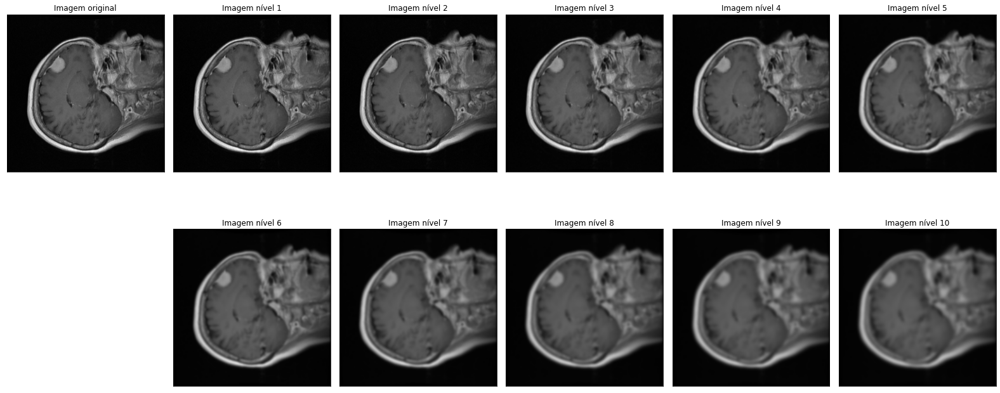

# Blurring

The blurring technique creates a smooth blur resembling that of viewing through a translucent screen. [Gaussian Blurring](https://en.wikipedia.org/wiki/Gaussian_blur) is an effective technique in the task of removing Gaussian noise from an image. We use the `GaussianBlur` function from [Opencv2](https://docs.opencv.org/3.4/d4/d13/tutorial_py_filtering.html) with varying the kernel standard deviation to obtain different levels of the blurring effect.
