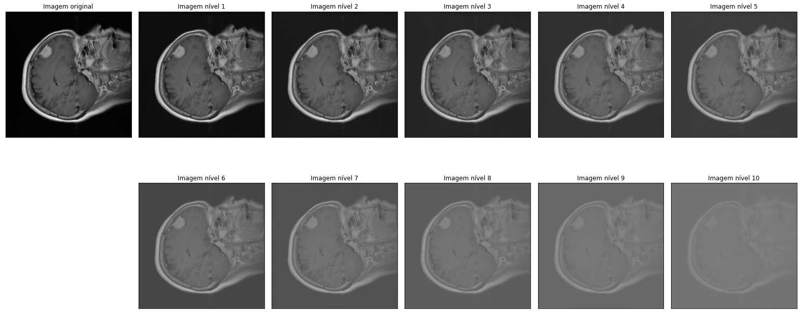

# Contrast

Contrast is related to range of pixel intensity values in an image. From the image bellow taken from [opencv docs](https://docs.opencv.org/3.4/d3/dc1/tutorial_basic_linear_transform.html) we can see the histogram of two images: an original one in light gray and a lower contrast version in dark gray.

To generate this effect we use linear transformations on the image intensity values by multiplying by an `alfa` and adding a `beta` following this nice explanation on [opencv docs](https://docs.opencv.org/3.4/d3/dc1/tutorial_basic_linear_transform.html). With varying levels of alpha and adjusting the beta to keep the histogram centered, we obtain our different levels of contrast.
