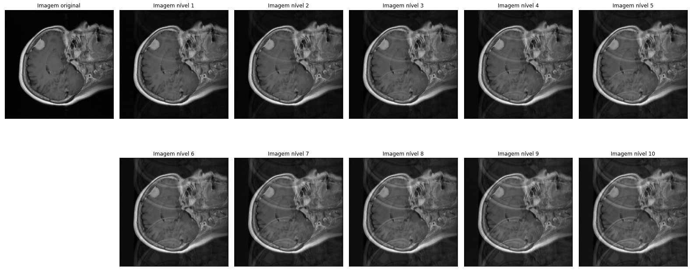

# Ghosting

Ghosting artifacts are found in MRI images and can have patient-related causes like pulsatile flow of blood, cardiac motion and respiratory motion (from [mri questions](https://mriquestions.com/why-discrete-ghosts.html) and [TorchIO](https://torchio.readthedocs.io/transforms/augmentation.html#torchio.transforms.RandomGhosting)).

We used the ghosting function provided by the library [TorchIO](https://torchio.readthedocs.io/transforms/augmentation.html) with some adjustments to bypass the randomness of the function and obtain constant results. This means that while ghosting artifacts can vary in many different ways, we choose arbitrary values to the defining factors like number of ghosts, intensities, restore and axis so that results could be reproducible.

**Note:** You will need to install the [TorchIO](https://torchio.readthedocs.io/transforms/augmentation.html) library to use this function ([pip](https://pypi.org/project/pip/) is recommended).
