# Tumor Type Classification
<!-- {: .no_toc } -->

## Quick Review


## Dataset

For this problem we used the database named [*Brain Tumor Dataset*](https://figshare.com/articles/dataset/brain_tumor_dataset/1512427). It contains 3064 magnetic resonance images of type T1, from 233 patients, which can have one of 3 types of cancer: *meningioma* (708 images), *glioma* (708) and *pituitary* (930).

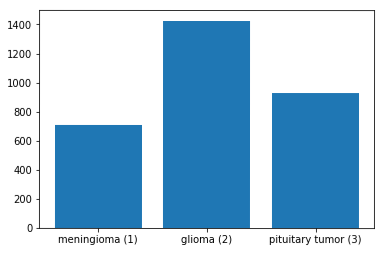  
*[Image source](https://github.com/guillaumefrd/brain-tumor-mri-dataset/blob/master/data_visualization.ipynb)*


The dataset comes in a different file format commonly used in matlab. An adaptation was made to this [notebook](https://github.com/aksh-ai/neuralBlack/blob/master/brain_tumor_dataset_preparation.ipynb) to extract the images in png format. A [folder with all the 3064 images extracted](https://drive.google.com/drive/folders/1-0i-Q2-to2y5_IyOZMmTzE8WbEuvbj0B?usp=sharing) is available in our drive.

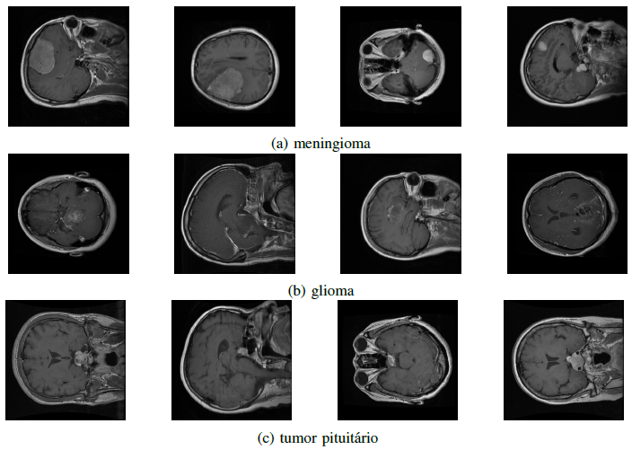

The images are 2 dimensional and single channel (0-255). Each of them comes with the tumor label, patient ID, tumor border (4 points describing the bounding box of the tumor) and a tumor mask (binary image with 1s indicating tumor region). The following image illustrates brain scans with tumor highlighting using the available masks.

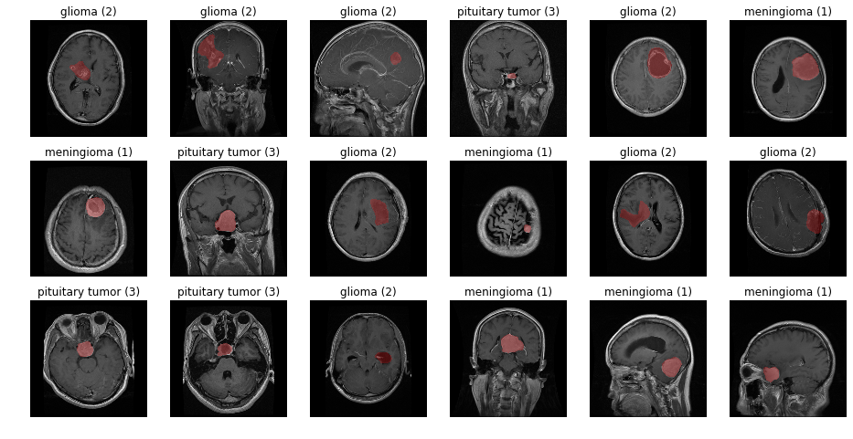  
*[Image source](https://github.com/guillaumefrd/brain-tumor-mri-dataset/blob/master/data_visualization.ipynb)*

Following common recommendations, we choose to split the dataset in train (70%), test (15%) and validation (15%). Because there are patients with more than one image, it was necessary to make sure that images from the same patient are present in only one of the splits. Not taking this measure can alter the results slightly.

The number of patients per class are the following:

| Type | Number of patients |
| -----------       | ----  |
| Meningioma        | 82    |
| Glioma            | 89    |
| Pituitary tumor   | 62    |
| **Total**         |**233**|

The same class imbalance present in the image numbers is also present in the patient counts. The split of patients per class in the 3 sets is shown bellow:

| Split     | Meningioma | Glioma | Pituitary Tumor | Total |
| :-:       | :-:| :-:| :-:| :-:    |
| Train     | 57 | 62 | 43 | **162**|
| Validation| 13 | 14 | 10 | **37** |
| Test      | 12 | 13 | 9  | **34** |

|Split| Number of images |
| - | - |
|Train | 2089 |
|Validation | 515 |
|Test | 460 |
|**Total**|**3064**

## Architecture

Our code is developed using the [PyTorch](https://pytorch.org/) framework and is available [here](https://github.com/gianlopes/brain_tumor_classifier). It can be run on Google Colab with some adaptations (mostly to allow access to drive and also to print images instead of just saving them), but we personally recommend running it on a server with a dedicated GPU. A [docker file](https://github.com/gianlopes/pytorch-docker/blob/main/Dockerfile) was developed with the essential tools to run the code with our nvidia GPU and can be used as base in other workflows.

The architecture is defined in the file *neural_network.py*. The chosen model for testing was the [Resnet50](https://pytorch.org/hub/pytorch_vision_resnet/), a well known architecture for dealing with image classification based in deep residual networks (a good article about those can be found [here](https://arxiv.org/abs/1512.03385)).

Pytorch provides us with several already implemented nn architectures that also come with pre-trained weights. These weights can be very helpful in speeding up the training process by making use of transfer learning and then fine tuning them to the necessities of our application.

In the code block bellow it's possible to see how easy it is to use PyTorch in this process. We simply import Resnet50 from [Pytorch's list of available models](https://pytorch.org/vision/stable/models.html). You can change the architecture of this project by changing that line.

It's also necessary to change the last layer in the architecture, as original Resnets are trained to work on ImageNet dataset with hundreds of classes. To do so, we change the fully connected layer in the model to have a few linear layers that converge in three nodes related to the three classes in the problem.

```python
    # instantiate transfer learning model
    model = models.resnet50(pretrained=True)

    # set all paramters as trainable
    for param in model.parameters():
        # param.requires_grad = False
        param.requires_grad = True

    # get input of fc layer
    n_inputs = model.fc.in_features

    # redefine fc layer / top layer/ head for our classification problem
    model.fc = nn.Sequential(nn.Linear(n_inputs, 2048),
                                    nn.SELU(),
                                    nn.Dropout(p=0.4),
                                    nn.Linear(2048, 2048),
                                    nn.SELU(),
                                    nn.Dropout(p=0.4),
                                    nn.Linear(2048, num_classes),
                                    nn.LogSigmoid())
```

This architecture and implementation used the following references: [Neural Black github repository](https://github.com/aksh-ai/neuralBlack) and the article [An Enhanced Deep Learning Approach for Brain Cancer MRI Images Classification using Residual Networks](https://www.researchgate.net/publication/337877208_An_Enhanced_Deep_Learning_Approach_for_Brain_Cancer_MRI_Images_Classification_using_Residual_Networks)

\# TODO: Further testing with more architectures.

## Results

Multiple tests with different purposes were made.

### About patients

On the sections above we have pointed out that there were patients with more than one image in the dataset and that we should be cautious with this fact as it might influence results. To see these results, we decided to test both datasets, one where extra care was taken to not have the same patient in train, validation and test datasets and other where they were all mixed.


When all images were mixed without care, the model had 99.13% accuracy, 0.0306 loss and the following confusion matrix and stats:

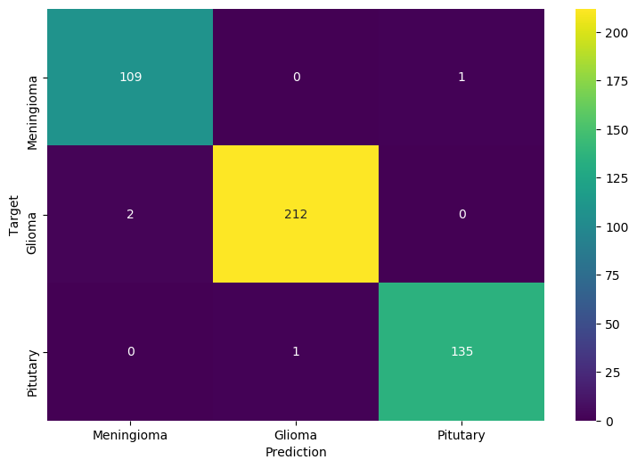

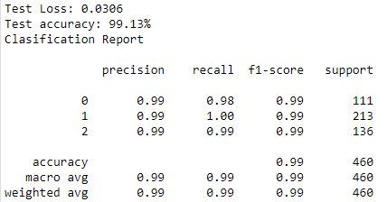

When patients were taken into consideration while splitting the data, a smaller accuracy of 93.91% was observed.

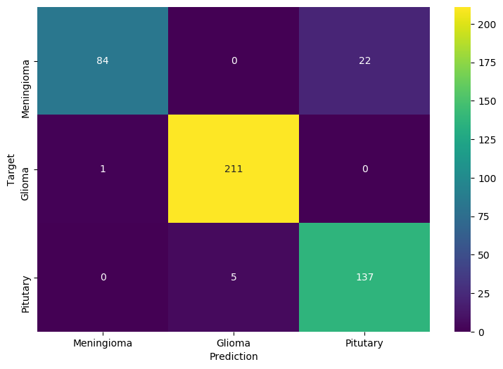

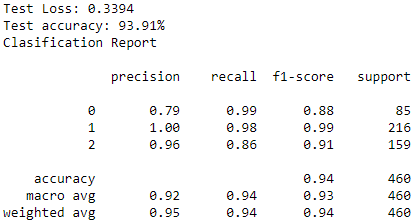

Looking in these stats, it's clear they can be influenced. A similar result was seen in [this paper](https://www.researchgate.net/publication/337877208_An_Enhanced_Deep_Learning_Approach_for_Brain_Cancer_MRI_Images_Classification_using_Residual_Networks). [This jupyter notebook](https://colab.research.google.com/drive/1mJa1CZ7JbXEeG1dCVoWnLPebUhShF1fn?usp=sharing) takes a look into the misclassified images, which were mostly true Meningioma tumors classified as Pituitary by the model. Turns out most of them were meningioma, but were also located close to the Pituitary region which could be a possible reason to the model's confusion. When these images were mixed, the model possibly had access to some images of these patients in the training phase, which made the decision process easier. Taking a look at the heat maps wasn't enough to conclude that the model was learning patient features aside from the tumor, but that could be a possibility.

### Artifacts

*Note: In the artifact generation documentation, there's a disclaimer explaining some nuance about the degradation levels that is very important to be read before trying to take any conclusions about these results.*

The artifacts listed in the *\#Artifacts* tab were the main target of our testing. We wanted to see the impact of the artifacts when they were present in the test set, while the neural network had never seen images with such effects. To do this we had the following setup:

Training set -> Original

Validation set -> Original

Test set -> Applied a single artifact in a single specific level to **all images**

We repeated this test process to every artifact with each of the 10 degradation levels defined. The following graph illustrates the results we achieved:

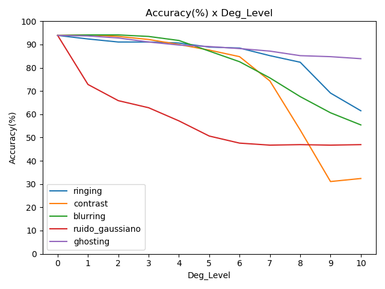

*Note: the graph was plotted with lines to give a better feel of progression, but remember these results are punctual and not continuous.*

#### Blurring

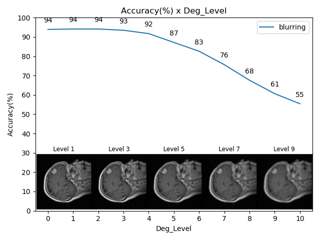

#### Contrast

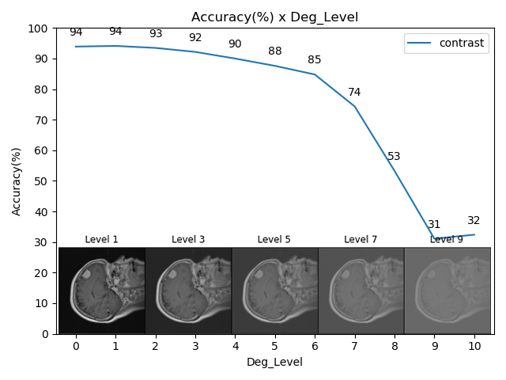

#### Gaussian Noise

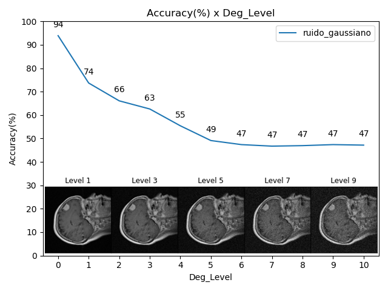

#### Ghosting

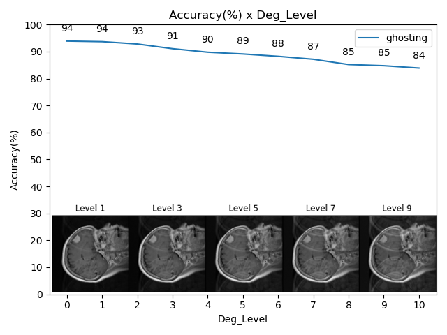

#### Ringing

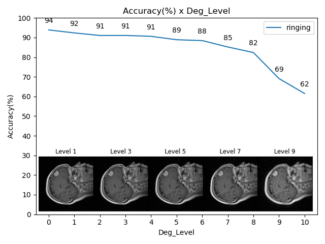

### TODO

Comentar sobre os resultados acima e adicionar os outros.
Explicar melhor a arquitetura.
